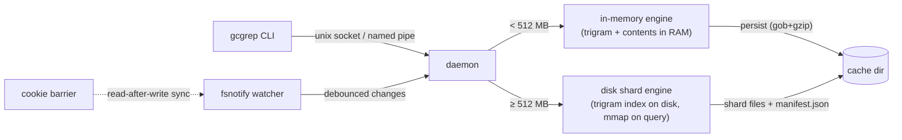

# gcgrep

[](LICENSE)
[](go.mod)
[]()

**Indexed, IDE-grade code search with a grep-compatible CLI.** Built for AI
coding agents and humans tired of slow `grep -r` — especially on Windows 11,
where NTFS and Defender real-time scanning make every full-tree search
painful.

A resident daemon builds a trigram + symbol index on first use, then keeps
it live via file watching. Searches answer in milliseconds without touching
the filesystem. For large repos (> 512 MB), a disk-backed shard engine keeps
idle memory under 100 MB regardless of source size.

```text
$ gcgrep def NewSchedulerCommand ./kubernetes
cmd/kube-scheduler/app/server.go:93: [func NewSchedulerCommand] ...

$ gcgrep refs NewSchedulerCommand ./kubernetes
cmd/kube-scheduler/scheduler.go:30: [call] command := app.NewSchedulerCommand()

$ gcgrep 'leaderelection' ./kubernetes     # plain grep, but 5ms warm
```

## Performance

Tested on two real codebases:

- **Kubernetes** (380 MB, 30k files) — medium Go project
- **Linux kernel** (1.5 GB, 93k files) — large C project

Both projects use the **disk shard engine** (default). Selective = rare identifier
(trigram index skips most files); broad = common keyword `include` (~46k matches in
Linux kernel). Default `--limit 2000`.

### macOS (Apple Silicon, 16 cores)

| | Kubernetes (380 MB) | | Linux kernel (1.5 GB) | |
|---|---|---|---|---|
| | **gcgrep** | **grep** | **gcgrep** | **grep** |
| Cold index | 13s | — | 43s | — |
| Warm selective | **30 ms** | 2.6s (**87×**) | **30 ms** | 11s (**367×**) |
| Warm broad | **190 ms** | 3.5s (**18×**) | **4.2s** | 16.7s (**4×**) |
| Idle memory | 63 MB | 3 MB¹ | 119 MB | 3 MB¹ |
| Idle CPU | 0% | — | 0% | — |
| Query CPU (max cores) | ~2 | ~1 | ~2 | ~1 |
| Index on disk | 40 MB (11%) | 0 | 153 MB (10%) | 0 |

### Windows 11 (x64, 4 cores, Defender enabled)

| | Kubernetes (380 MB) | | | Linux kernel (1.5 GB) | | |
|---|---|---|---|---|---|---|
| | **gcgrep** | **rg** | **findstr** | **gcgrep** | **rg** | **findstr** |
| Cold index | 38s | — | — | 112s | — | — |
| Warm selective | **175 ms** | 1.1s | 1.9s | **181 ms** | 2.6s (**14×**) | 5.9s (**33×**) |
| Warm broad | **1.3s** | 1.2s | 2.1s | **14.1s** | 8.1s | 10.8s |
| Idle memory | 63 MB² | 0 | 0 | 120 MB² | 0 | 0 |
| Idle CPU | 0% | — | — | 0% | — | — |
| Query CPU (max cores) | ~2 | ~1 | ~1 | ~2 | ~1 | ~1 |
| Index on disk | 40 MB (11%) | 0 | 0 | 153 MB (10%) | 0 | 0 |

### Windows 11 + inline content (`GCGREP_SHARD_INLINE_KB=64`)

Files ≤ 64 KB are stored in the shard, eliminating per-file `os.Open` on NTFS.
96.8% of source files are inlined; the remaining 3.2% large files still read from disk.

| | Linux kernel (1.5 GB) | rg | findstr |
|---|---|---|---|
| Warm selective | **156 ms** | 2.6s (**17×**) | 5.9s (**38×**) |
| Warm broad | **8.6s** | 8.1s | 10.8s |
| Index on disk | 873 MB (58%) | 0 | 0 |

**Notes:**
- ¹ grep is a one-shot process (no daemon). 3 MB is its peak RSS during the query. gcgrep's idle memory is the daemon footprint between queries.
- ² True idle memory (shard descriptors + trigram key tables). Windows Working Set may appear higher after queries due to Go GC delayed page release.
- Write-after-read consistency: 25/25 on both platforms (watchman-style cookie barrier).
- Search accuracy: 0 diff vs grep on all tested patterns (line-level comparison).
- The daemon runs at low OS priority (nice+10 / BELOW_NORMAL) — never competes with foreground processes.

## Features

- **grep-compatible text search**: regex, `-i`, `-F`, `-l`, `-c`, `-g GLOB`,
  `file:line:text` output, grep exit codes. Drop-in for most workflows.
- **Symbol search** (Go, Java, Python, TypeScript/JavaScript):
  - `gcgrep def NAME` — find class/struct/interface/enum/func/method
    definitions (Go via the real parser; others ctags-grade heuristics)
  - `gcgrep refs NAME` — candidate references and call sites, comment- and
    string-aware
  - `gcgrep symbols FILE` — outline of one file
- **Dual engine**: in-memory for repos under 512 MB (fastest queries),
  disk shards for larger repos (bounded memory). Configurable via
  `GCGREP_ENGINE` and `GCGREP_DISK_ENGINE_MB`.
- **Live index**: file create/modify/delete applied automatically
  (debounced watcher; event-overflow falls back to a reconcile scan).
- **Read-after-write consistency**: a search issued right after a file
  write is guaranteed to observe it (watchman-style cookie barrier, ~1 ms
  overhead). Safe for AI edit-then-verify loops. `--no-sync` opts out.
- **Restart-safe**: indexes persist; restart does a stat-only reconcile
  that also catches changes made while the daemon was down.
- **No ports**: unix domain socket (macOS/Linux) / named pipe (Windows).
- **Indexes everything, excludes explicitly**: unlike ripgrep, gcgrep does
  NOT silently honor `.gitignore` — gitignored dirs (Maven dependency
  sources, build output) are often exactly what you want to search.
  Always skips `.git`; add a `.gcgrepignore` at the root (gitignore
  syntax) for anything else.
- **Nothing is unsearchable**: files too large to index (> 2 MB default),
  binary files and files past the RAM budget stay searchable — the daemon
  tracks them and the client scans them from disk at query time
  (rg-style), transparently merged into the same output.
- **rg-aligned filters**: hidden files skipped by default + `--hidden`,
  binary skipped + `-a/--text`, symlinks not followed + `-L/--follow`
  (cycle-safe), `--max-filesize 50M`. UTF-16 files are transcoded and
  indexed as UTF-8.
- **Resource-restrained**: indexing workers default to min(cores/2, 8)
  and the daemon runs at low OS priority (`GCGREP_PRIORITY=normal` to
  opt out) — it never competes with your build.
- **Long-line aware**: full lines by default (grep/rg parity). With
  `--max-columns N` (or `GCGREP_MAX_COLUMNS`), long lines travel as
  location-only events and the client renders an N-byte window centered
  on the hit — recommended for AI agents to protect token budgets.
- **Tunable**: every former hardcoded limit is a `GCGREP_*` env var —
  `GCGREP_MAX_FILESIZE_MB` (default 2; larger files are skipped and
  counted in `gcgrep status`), `GCGREP_MAX_INDEX_MB` (per-root RAM
  budget), `GCGREP_BARRIER_TIMEOUT_MS`, `GCGREP_DEBOUNCE_MS`,
  `GCGREP_SAVE_DELAY_MS`, `GCGREP_WORKERS`, `GCGREP_LIMIT`,
  `GCGREP_MAX_COLUMNS`, `GCGREP_SPAWN_TIMEOUT_MS`, `GCGREP_DIAL_TIMEOUT_MS`,
  `GCGREP_PRIORITY`. The daemon logs effective overrides at startup.

## Install

Download a binary from [Releases](https://github.com/zliss/gcgrep/releases)
and put it on your `PATH`, or build from source:

```sh
go build -o gcgrep ./cmd/gcgrep
```

No service setup: the daemon auto-starts on first use and persists across
sessions. `gcgrep stop` shuts it down (indexes are saved).

## Usage

```text
gcgrep [options] PATTERN [PATH]   text search (regex) under PATH (default .)
gcgrep def [-i] NAME [PATH]       find symbol definitions
gcgrep refs NAME [PATH]           find candidate references/calls
gcgrep symbols FILE               list definitions in FILE
gcgrep status | stop | daemon

-i           case-insensitive        -F           fixed string
-l           file names only         -c           per-file match counts
-g GLOB      filter files            --json       JSON-lines output
--limit N    cap output (2000)       --no-sync    skip write barrier
--hidden     include dot-files       -a, --text   binaries as text
-L, --follow follow symlinks         --max-filesize SIZE  (e.g. 50M)
```

Exit codes follow grep: `0` match, `1` no match, `2` error. First search of
a directory streams indexing progress to stderr.

### What is NOT searchable (complete list)

Every skip is counted and visible in `gcgrep status` — nothing is
silently unsearchable without a number telling you so:

1. `.git` directories (always).
2. Rules in a root `.gcgrepignore` (yours).
3. Hidden files/dirs by default → use `--hidden` (query-time, no reindex).
4. Symlinks by default → use `-L/--follow` (cycle-safe; a follow variant
   keeps its own index).
5. Non-regular files (sockets, fifos, devices).
6. Unreadable files/dirs (permissions, vanished mid-read) → counted.

Files larger than `GCGREP_MAX_FILESIZE_MB` (default 2), files beyond the
`GCGREP_MAX_INDEX_MB` budget and binary files (NUL in the first 8 KB) are
**not in the index but still searched**: the client scans them from disk
at query time (binaries only with `-a`). UTF-16 files with a BOM are
transcoded and indexed as regular text.

### Honest limits

- `refs` is **syntax-level**: it cannot distinguish overloads or same-named
  methods of unrelated types (that requires type resolution — IDE/LSP
  territory). It is a high-recall candidate list, comment/string-filtered.
- Symbol extraction for Java/Python/TS is ctags-grade heuristics; Go uses
  the real parser. Other languages get text search only.
- Exclusions read root `.gcgrepignore` only; `!negation` rules are ignored
  conservatively.
- Memory: disk engine (default) idle memory is ~60-120 MB regardless of
  source size. In-memory engine (`GCGREP_ENGINE=mem`) holds file contents
  in RAM (~1.5× source size) and is capped at `GCGREP_MAX_INDEX_MB` (256 MB).

## For AI assistants

Paste into your agent instructions (e.g. `CLAUDE.md`):

```markdown
- Prefer `gcgrep` over grep/rg for code search (falls back to grep if not
  installed). Same output format and exit codes. Fast after first use.
  - text: `gcgrep PATTERN [DIR]` (flags: -i -F -l -c -g --json --limit)
  - find definition: `gcgrep def NAME [DIR]`
  - find usages/calls (candidates): `gcgrep refs NAME [DIR]`
  - file outline: `gcgrep symbols FILE`
  Searching immediately after editing files is safe (read-after-write
  consistent). First search of a directory builds the index once.
```

For agents, also set `GCGREP_MAX_COLUMNS=4096` in the environment: matches
inside minified single-line files then render as a 4 KB window around the
hit instead of multi-KB raw lines, protecting the context window.

## How it works



**In-memory engine** (repos < 512 MB): trigram posting lists + file
contents in RAM. Fastest queries (~5 ms warm). Persisted as compressed
gob; restart reconciles with a stat-only walk.

**Disk shard engine** (repos ≥ 512 MB): source files are partitioned into
ordered, immutable shard files (~80 MB each). Each shard stores a trigram
index and file metadata. Shards are mmap'd only during queries and
munmap'd afterward — idle memory stays under 100 MB for any repo size.
A trigram key table is held in memory per shard (~300 KB each) to skip
irrelevant shards without mmap. File changes go to a dirty list (scanned
at query time for instant consistency); background rebuild merges dirty
files back into shards when enough accumulate.

State lives in the user cache dir (`~/Library/Caches/gcgrep`,
`%LOCALAPPDATA%\gcgrep`, `~/.cache/gcgrep`).

## Configuration

| Variable | Default | Description |
|---|---|---|
| `GCGREP_ENGINE` | `auto` | `auto`, `mem`, or `disk` |
| `GCGREP_DISK_ENGINE_MB` | `10` | Source size threshold for auto disk switch |
| `GCGREP_MAX_FILESIZE_MB` | `2` | Files larger than this skip the index (still searchable via stream scan) |
| `GCGREP_MAX_INDEX_MB` | `256` | Per-root RAM budget for in-memory engine |
| `GCGREP_WORKERS` | `min(cores/2, 8)` | Parallel indexing workers |
| `GCGREP_PRIORITY` | `low` | Daemon OS priority (`low` or `normal`) |
| `GCGREP_REBUILD_INTERVAL_MS` | `20000` | Disk engine shard rebuild cycle |
| `GCGREP_SHARD_TARGET_MB` | `80` | Target shard source size |
| `GCGREP_SHARD_MIN_MB` | `32` | Merge shards below this size |
| `GCGREP_SHARD_MAX_MB` | `128` | Split shards above this size |
| `GCGREP_REBUILD_THRESHOLD` | `20` | Min dirty files per shard to trigger rebuild |
| `GCGREP_SEARCH_WORKERS` | `2` | Parallel search goroutines (overlap I/O waits) |
| `GCGREP_MEMORY_LIMIT_MB` | `100` | Go soft memory limit for disk engine daemon |
| `GCGREP_SHARD_INLINE_KB` | `0` | Inline file content in shard for files ≤ this size (KB). Windows-only optimization — eliminates per-file `os.Open` overhead on NTFS. Recommended: 64 |
| `GCGREP_LIMIT` | `2000` | Default output line cap |
| `GCGREP_MAX_COLUMNS` | `0` (unlimited) | Truncate long match lines |
| `GCGREP_BARRIER_TIMEOUT_MS` | `2000` | Read-after-write barrier timeout |
| `GCGREP_DEBOUNCE_MS` | `100` | File change debounce window |
| `GCGREP_SAVE_DELAY_MS` | `30000` | In-memory engine persist delay |
| `GCGREP_SPAWN_TIMEOUT_MS` | `60000` | Daemon auto-start timeout |
| `GCGREP_DIAL_TIMEOUT_MS` | `5000` | Client connect timeout |

The daemon logs effective overrides at startup.

## Development

```sh
go test ./...        # unit + integration tests
scripts/vmbuild.sh   # fmt/vet/test + cross-compile all platforms
```

## License

[MIT](LICENSE)
