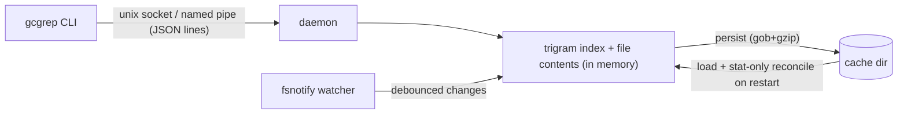

# gcgrep

Indexed, grep-like code search. The first search of a directory builds an
in-memory trigram index held by a resident daemon; file changes are watched
and applied incrementally (like an IDE), so every later search answers in
milliseconds — no per-search filesystem scan, which is what makes `grep -r`
slow and CPU-hungry, especially on Windows 11 (NTFS + Defender real-time
scanning of every opened file).

- **Fast**: 30k files index in ~1.6 s; warm literal query ~4 ms end to end.
- **Live**: file create/modify/delete is picked up within ~1 s automatically.
- **Restart-safe**: indexes persist to disk; on daemon restart a stat-only
  reconcile pass catches everything that changed while it was down.
- **No ports**: client and daemon talk over a unix domain socket (macOS,
  Linux) or named pipe (Windows). Nothing listens on TCP.
- **Zero config**: respects the root `.gitignore`, always skips `.git`,
  binaries and files > 2 MB.

Supported: macOS (arm64), Windows 11 (amd64). Linux builds and passes tests
but is not a release target yet.

## Install

Download a release binary and put it on your `PATH`, or build from source:

```sh
go build -o gcgrep ./cmd/gcgrep
```

No service registration is needed: the daemon starts on first use.

## Usage

```text
gcgrep [options] PATTERN [PATH]   search PATH (default .) for regex PATTERN
gcgrep status                     show daemon state and indexed roots
gcgrep stop                       stop the daemon (indexes are persisted)

-i          case-insensitive
-F          fixed string instead of regex
-l          file names only
-c          per-file match counts
-g GLOB     only files matching GLOB (repeatable)
--json      machine-readable JSON-lines output
--limit N   stop after N lines (default 2000, 0 = unlimited)
```

Output is `file:line:text`, exit codes follow grep (0 match, 1 no match,
2 error). The first search of a directory streams indexing progress to
stderr; subsequent searches are served from the live index.

## For AI assistants

Paste this into your agent instructions (e.g. `CLAUDE.md`) after installing:

```markdown
- Use `gcgrep PATTERN [DIR]` instead of grep/rg for code search: it is
  index-backed and much faster on repeated searches. Output format and exit
  codes match grep (`file:line:text`). Flags: -i, -F, -l, -c, -g GLOB,
  --json, --limit N. The first search of a directory builds the index
  (one-time, progress on stderr); the index then stays current automatically.
```

## How it works



Queries extract a required literal from the regex, intersect its trigram
posting lists to get candidate files, then confirm with the real regex over
in-memory contents. Watcher event-buffer overflow (e.g. a huge `git
checkout`) triggers a full reconcile rather than trusting the event stream.

State lives in the user cache dir (`~/Library/Caches/gcgrep`,
`%LOCALAPPDATA%\gcgrep`, `~/.cache/gcgrep`): index files, daemon log,
socket.

## Development

`scripts/vmbuild.sh` syncs to a Linux build host, runs gofmt/vet/tests and
cross-compiles binaries + test binaries for all platforms into `dist/`;
`scripts/win_test.ps1` runs the unit and end-to-end suite on a Windows
machine. Tests cover index correctness, gitignore matching, live watching,
persistence and offline-change reconciliation.

## License

MIT
