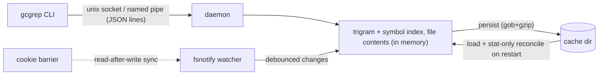

# gcgrep

[](LICENSE)
[](go.mod)
[]()

**Indexed, IDE-grade code search with a grep-compatible CLI.** Built for AI
coding agents and humans tired of slow `grep -r` — especially on Windows 11,
where NTFS and Defender real-time scanning make every full-tree search
painful.

The first search of a directory builds an in-memory trigram + symbol index
held by a resident daemon. File changes are watched and applied
incrementally (like an IDE), so every later search answers in milliseconds
without touching the filesystem.

```text
$ gcgrep def NewSchedulerCommand ./kubernetes
cmd/kube-scheduler/app/server.go:93: [func NewSchedulerCommand] func NewSchedulerCommand(registryOptions ...Option) *cobra.Command {

$ gcgrep refs NewSchedulerCommand ./kubernetes
cmd/kube-scheduler/scheduler.go:30: [call] command := app.NewSchedulerCommand()
...

$ gcgrep 'leaderelection' ./kubernetes     # plain grep, but 5ms warm
```

## Why

| kubernetes/kubernetes, 30k files | macOS | Windows 11 |
|---|---|---|
| `grep -rn` / `findstr /s` | 260 ms | 1.8 s |
| PowerShell `Select-String` | — | 9.4 s |
| **gcgrep (warm)** | **5 ms** | **37 ms** |
| gcgrep `refs` (warm) | 6 ms | 55 ms |
| one-time cold index | 8 s | 55 s |

Config-heavy repos benefit even more. On a 29k-file corpus of real i18n
JSON (vscode-loc) plus a large npm dependency tree — including 369 files
with single lines over 2000 chars (minified bundles):

| 29k files, 345 MB, long-line heavy | macOS | Windows 11 |
|---|---|---|
| `grep -rn` / `findstr /s` (warm cache) | 2.2–4.4 s | 1.8–2.0 s |
| **gcgrep (warm, 1550 hits in minified i18n)** | **17 ms** | **38 ms** |

## Features

- **grep-compatible text search**: regex, `-i`, `-F`, `-l`, `-c`, `-g GLOB`,
  `file:line:text` output, grep exit codes. Drop-in for most workflows.
- **Symbol search** (Go, Java, Python, TypeScript/JavaScript):
  - `gcgrep def NAME` — find class/struct/interface/enum/func/method
    definitions (Go via the real parser; others ctags-grade heuristics)
  - `gcgrep refs NAME` — candidate references and call sites, comment- and
    string-aware
  - `gcgrep symbols FILE` — outline of one file
- **Live index**: file create/modify/delete applied automatically
  (debounced watcher; event-overflow falls back to a reconcile scan).
- **Read-after-write consistency**: a search issued right after a file
  write is guaranteed to observe it (watchman-style cookie barrier, ~1 ms
  overhead). Safe for AI edit-then-verify loops. `--no-sync` opts out.
- **Restart-safe**: indexes persist; restart does a stat-only reconcile
  that also catches changes made while the daemon was down.
- **No ports**: unix domain socket (macOS/Linux) / named pipe (Windows).
- **Indexes everything, excludes explicitly**: unlike ripgrep, gcgrep does
  NOT silently honor `.gitignore` — gitignored dirs (Maven dependency
  sources, build output) are often exactly what you want to search.
  Always skips `.git`; add a `.gcgrepignore` at the root (gitignore
  syntax) for anything else.
- **Nothing is unsearchable**: files too large to index (> 2 MB default),
  binary files and files past the RAM budget stay searchable — the daemon
  tracks them and the client scans them from disk at query time
  (rg-style), transparently merged into the same output.
- **rg-aligned filters**: hidden files skipped by default + `--hidden`,
  binary skipped + `-a/--text`, symlinks not followed + `-L/--follow`
  (cycle-safe), `--max-filesize 50M`. UTF-16 files are transcoded and
  indexed as UTF-8.
- **Resource-restrained**: indexing workers default to min(cores/2, 8)
  and the daemon runs at low OS priority (`GCGREP_PRIORITY=normal` to
  opt out) — it never competes with your build.
- **Long-line aware**: full lines by default (grep/rg parity). With
  `--max-columns N` (or `GCGREP_MAX_COLUMNS`), long lines travel as
  location-only events and the client renders an N-byte window centered
  on the hit — recommended for AI agents to protect token budgets.
- **Tunable**: every former hardcoded limit is a `GCGREP_*` env var —
  `GCGREP_MAX_FILESIZE_MB` (default 2; larger files are skipped and
  counted in `gcgrep status`), `GCGREP_MAX_INDEX_MB` (per-root RAM
  budget), `GCGREP_BARRIER_TIMEOUT_MS`, `GCGREP_DEBOUNCE_MS`,
  `GCGREP_SAVE_DELAY_MS`, `GCGREP_WORKERS`, `GCGREP_LIMIT`,
  `GCGREP_MAX_COLUMNS`, `GCGREP_SPAWN_TIMEOUT_MS`, `GCGREP_DIAL_TIMEOUT_MS`,
  `GCGREP_PRIORITY`. The daemon logs effective overrides at startup.

## Install

Download a binary from [Releases](https://github.com/zliss/gcgrep/releases)
and put it on your `PATH`, or build from source:

```sh
go build -o gcgrep ./cmd/gcgrep
```

No service setup: the daemon auto-starts on first use and persists across
sessions. `gcgrep stop` shuts it down (indexes are saved).

## Usage

```text
gcgrep [options] PATTERN [PATH]   text search (regex) under PATH (default .)
gcgrep def [-i] NAME [PATH]       find symbol definitions
gcgrep refs NAME [PATH]           find candidate references/calls
gcgrep symbols FILE               list definitions in FILE
gcgrep status | stop | daemon

-i           case-insensitive        -F           fixed string
-l           file names only         -c           per-file match counts
-g GLOB      filter files            --json       JSON-lines output
--limit N    cap output (2000)       --no-sync    skip write barrier
--hidden     include dot-files       -a, --text   binaries as text
-L, --follow follow symlinks         --max-filesize SIZE  (e.g. 50M)
```

Exit codes follow grep: `0` match, `1` no match, `2` error. First search of
a directory streams indexing progress to stderr.

### What is NOT searchable (complete list)

Every skip is counted and visible in `gcgrep status` — nothing is
silently unsearchable without a number telling you so:

1. `.git` directories (always).
2. Rules in a root `.gcgrepignore` (yours).
3. Hidden files/dirs by default → use `--hidden` (query-time, no reindex).
4. Symlinks by default → use `-L/--follow` (cycle-safe; a follow variant
   keeps its own index).
5. Non-regular files (sockets, fifos, devices).
6. Unreadable files/dirs (permissions, vanished mid-read) → counted.

Files larger than `GCGREP_MAX_FILESIZE_MB` (default 2), files beyond the
`GCGREP_MAX_INDEX_MB` budget and binary files (NUL in the first 8 KB) are
**not in the index but still searched**: the client scans them from disk
at query time (binaries only with `-a`). UTF-16 files with a BOM are
transcoded and indexed as regular text.

### Honest limits

- `refs` is **syntax-level**: it cannot distinguish overloads or same-named
  methods of unrelated types (that requires type resolution — IDE/LSP
  territory). It is a high-recall candidate list, comment/string-filtered.
- Symbol extraction for Java/Python/TS is ctags-grade heuristics; Go uses
  the real parser. Other languages get text search only.
- Exclusions read root `.gcgrepignore` only; `!negation` rules are ignored
  conservatively.
- Memory: file contents live in RAM (~1.5× source size; k8s ≈ 700 MB).

## For AI assistants

Paste into your agent instructions (e.g. `CLAUDE.md`):

```markdown
- Prefer `gcgrep` over grep/rg for code search (falls back to grep if not
  installed). Same output format and exit codes. Fast after first use.
  - text: `gcgrep PATTERN [DIR]` (flags: -i -F -l -c -g --json --limit)
  - find definition: `gcgrep def NAME [DIR]`
  - find usages/calls (candidates): `gcgrep refs NAME [DIR]`
  - file outline: `gcgrep symbols FILE`
  Searching immediately after editing files is safe (read-after-write
  consistent). First search of a directory builds the index once.
```

For agents, also set `GCGREP_MAX_COLUMNS=4096` in the environment: matches
inside minified single-line files then render as a 4 KB window around the
hit instead of multi-KB raw lines, protecting the context window.

## How it works



Text queries extract a required literal from the regex, intersect trigram
posting lists for candidates, then confirm with the regex (or a direct
`bytes.Index` fast path for plain literals) over in-memory contents.
Symbols are extracted at index time (Go: stdlib AST; Java/Python/TS:
comment/string stripping + lexical heuristics) and stored per file.

State lives in the user cache dir (`~/Library/Caches/gcgrep`,
`%LOCALAPPDATA%\gcgrep`, `~/.cache/gcgrep`).

## Development

```sh
go test ./...        # unit + integration tests (index, watch, barrier, symbols)
scripts/vmbuild.sh   # fmt/vet/test + cross-compile all platforms (on a Linux host)
```

CI-grade coverage includes: trigram correctness, exclusion matching, live
watching, persistence + offline-change reconciliation, a no-sleep
read-after-write hammer test, and per-language symbol extraction suites.
Contributions welcome — adding a language = one extractor file + tests
(see `internal/symbol/`).

## License

[MIT](LICENSE)
