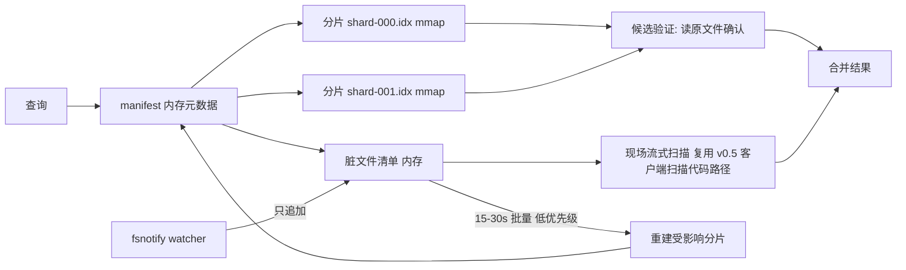

# v1.0 磁盘分片索引引擎设计（评审稿）

状态：**待评审**。本文档实现前需用户确认；已对齐的共识项标注【共识】，新提出待拍板的标注【待定】。

## 1. 目标与验收标准

【共识】当前 v0.5 引擎把文件内容全量驻留内存（~1.5× 源码体积，k8s ≈ 700MB），无法支撑大仓库。v1.0 引入磁盘分片引擎：

| 指标 | 目标 |
|---|---|
| 索引磁盘占用 | ≤ 源码体积 20% |
| warm 查询 p50 | < 100ms |
| daemon 常驻 RAM | < 500MB |
| 写后读一致 | 保留（零成本路径，见 §6） |
| 设计上限 | TB 级；**规模验证用 ~1GB 项目** |

## 2. 总体结构

【共识】核心思想：**不可变分片 + mmap + 不存内容副本 + 脏文件清单**。



- **分片（shard）**：一组文件的 trigram 倒排索引，写成单个不可变文件后 mmap。按目录序分组，单分片 ~10k 文件或 ~256MB 源码（先到为准）。【共识】
- **manifest**：根级元数据（分片列表、各分片的文件表摘要、格式版本），常驻内存，原子替换持久化。【共识】
- **脏文件清单（dirty list）**：watcher 事件只追加到该清单，不动分片。查询时分片结果排除脏文件旧条目，脏文件走现场流式扫描。【共识】

## 3. 分片文件格式

单文件布局（little-endian，所有 section 8 字节对齐）：

```
[header]       magic "GCSHARD1", 格式版本, section 偏移表
[file table]   该分片的文件条目数组: pathOffset(varint), size, mtimeNS
[path blob]    所有相对路径串接（UTF-8, 排序后前缀压缩【待定】）
[tri lookup]   排序的 trigram key 数组(uint32) + 对应 postings 偏移 —— 二分查找【共识】
[postings]     每个 trigram: 文档级 postings + 文档内字节偏移
[checksum]     xxhash64 整文件校验
```

**postings 编码**【共识】：
- 文档列表：fileID delta + varint。
- 每文档存该 trigram 的**字节偏移列表**（delta + varint），并记录首/末出现偏移。
- 查询时按 zoekt 方式利用「pattern 中两个 trigram 的距离 = 文件内偏移差」做剪枝：候选位置需满足 `offset(t2) - offset(t1) == dist(t1,t2)`，把候选从文件级缩到字节位置级，再读原文验证。

**不存内容副本**【共识】：验证阶段直接 `pread` 原文件对应行；若文件 `mtime/size` 与 file table 不符 → 该文件移入脏清单，本次查询对它走现场扫描（结果仍正确）。

## 4. 查询路径

1. barrier（不变，cookie 机制照旧）。
2. 提取 required literal → trigrams → 各分片 lookup 二分 → postings 求交（距离剪枝）。
3. 候选 (file, byteOffset)：排除「在脏清单中」的文件 → 读原文验证（按文件聚合，顺序 pread，行边界定位后跑 Matcher）。
4. 脏清单文件：现场流式扫描（与 v0.5 stream 集客户端扫描共用 `index.Matcher`，但在 daemon 侧执行，因为量小且需要合并排序）。【待定：脏文件扫描放 daemon 侧（量小、保持输出有序）还是沿用客户端扫描？建议 daemon 侧，理由：脏集是小集合（秒级窗口内的改动），不会复现 v0.4 的扫盘成本问题】
5. v0.5 的 stream 集（超大/二进制/超预算）逻辑不变，仍由客户端扫。
6. 合并、排序、limit、输出。

无 literal（<3 字节 pattern）时：退化为全文件扫描不可接受 → 【待定】对纯磁盘引擎，无 literal 查询按「分片 file table 顺序 + 并行 pread 扫描」执行并提示慢查询；与 rg 行为一致（rg 本来就全扫）。

## 5. 索引构建与重建

- 初次构建：walkdir 按目录序流式分组 → 每组在内存里建倒排（worker 并行，复用现有 TrigramKeys）→ 写分片文件 → 更新 manifest。峰值内存 = 单分片工作集（~256MB 源码的 trigram 表，约 100-150MB），与仓库总量无关。
- **重建**【共识】：后台任务每 15-30s（`GCGREP_REBUILD_INTERVAL_MS`）把脏清单按所属分片分组，重建受影响分片（读该分片 file table 的存活文件 + 脏改动），原子替换（写新文件 → manifest 切换 → munmap 旧文件延迟删除）。低优先级执行（daemon 本身已 BELOW_NORMAL/nice+10）。
- 重建期间查询不阻塞：manifest 切换是原子指针替换，旧分片 mmap 在在途查询结束后释放（引用计数）。
- 符号索引（def/refs）：【待定】v1.0 范围内符号表是否也分片落盘？建议 v1.0 先保持符号表内存常驻（其体积 ≈ 源码 1-3%，1GB 仓库约 10-30MB，不破 RAM 预算），def/refs 行为完全不变，降低本版风险。

## 6. 写后读一致

【共识】零成本保留：barrier 之后脏清单必然包含 barrier 前的全部写入（watcher → 只追加清单，无需建索引）；查询 = 分片(排除脏) ∪ 脏现场扫。即写入到可查的延迟 = barrier 延迟（~1ms），与重建周期无关。

## 7. 引擎选择与兼容

【待定，建议】：
- 默认自动：根的源码总量 > `GCGREP_DISK_ENGINE_MB`（默认 512）→ 磁盘引擎；否则沿用内存引擎（小仓库内存引擎延迟更优）。
- `GCGREP_ENGINE=mem|disk|auto` 强制指定。
- 磁盘索引放 cache dir 下 `shards-<roothash>/`；与内存引擎的 gob 持久化互不干扰。
- 协议、CLI 旗标零变化（对客户端透明）；status 增加 engine 字段与分片统计。

## 8. 验证计划（1GB 规模）

语料：现有 /tmp/bigrepo (345MB) + /tmp/kubernetes + 合成补足到 ~1GB（win2 同步 C:\t）。

1. 功能：现有全部单测 + E2E 在 disk 引擎下重跑（引擎用环境变量切换，测试矩阵 ×2）。
2. 验收指标逐项实测并记录：索引体积比、warm p50（100 次查询取中位）、RSS、写后立查 25 轮 hammer。
3. 增量正确性：改/增/删 → 立查 → 等重建周期过后再查，结果一致。
4. 崩溃恢复：构建中 kill -9 → 重启 → manifest 完整性（半成品分片丢弃重建）。
5. mac + win2 双平台。

## 9. 风险与对策

| 风险 | 对策 |
|---|---|
| Windows 上 mmap 文件被替换的句柄语义 | 新分片写新文件名（序号递增），不覆盖；旧文件延迟删除，删不掉留给下次启动清理 |
| 验证阶段随机 pread 在冷 page cache 下慢 | 按文件聚合候选、顺序读；p50 目标针对 warm |
| 无 literal 短 pattern 全扫慢 | stderr 提示 + 文档说明（与 rg 同级别成本） |
| postings 字节偏移使索引变大 | varint delta 实测约源码 10-15%（zoekt 经验值），仍在 20% 内；超标则偏移改行号粒度（备选） |

## 10. 不做的事（划界）

- 不做多机分布式、不做压缩内容存储（保持"不存副本"原则）。
- 不改符号搜索行为（见 §5 待定项）。
- 不动 v0.5 的 stream 集 / 隐藏 / follow 语义。
